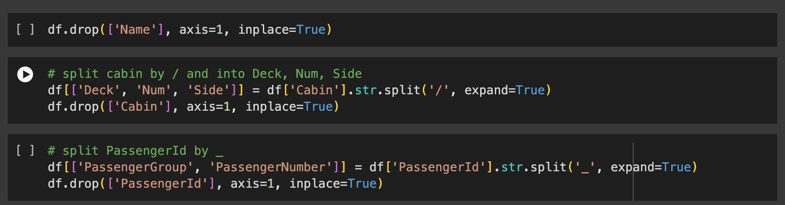
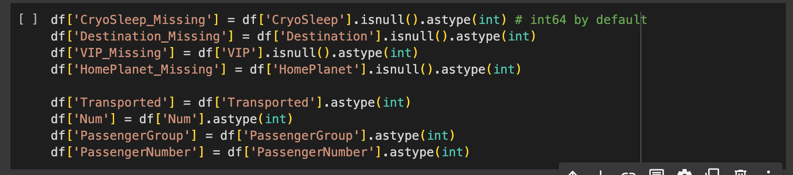
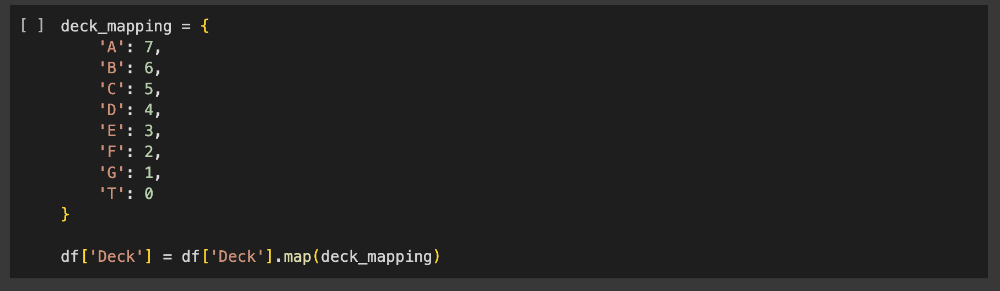
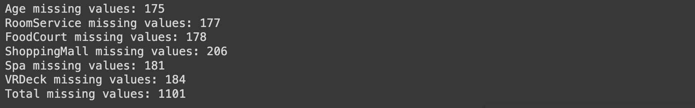
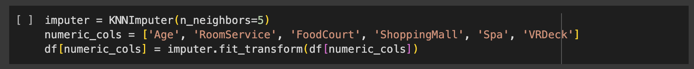
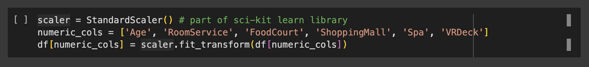

# Spaceship Titanic Problem with Kaggle
# ADD IN REFERENCES WHERE I HAVE TALKED ABOUT RECOMMENDED PARAMETERS

## Executive Summary

This project explores the Spaceship Titanic problem using machine learning (classifiers), to accurately predict a target variable (whether a passenger would be transported to another dimension) depending on a set of given features. The potential benefits are adding to the data science research community by showcasing new ways of tacking this classification task, which will also help companies discover new ways to solve business problems.
The Spaceship Titanic problem is a new ML classification problem with the goal of getting an highly accurate predictive model to help push the boundaries of data science.

## Data Preprocessing

The dataset, sourced from Kaggle's ["Spaceship Titanic Data"](https://www.kaggle.com/c/spaceship-titanic/data) includes features like passenger expenditures and VIP status. With around 9,000 records and 13 features in the test set, it was suitable for testing classifier accuracy.

### Loading and Initial Exploration

I began by importing all the relevant python packages and then importing the train dataset which was in a csv format. The dataset was loaded into a Pandas DataFrame using the `pd.read_csv()` function. 

The initial exploration of the dataset was then conducted to gain insights into its structure and contents.

### Data Selection and Renaming

From first thoughts, I planned to drop both 'PassengerId' and 'Name', to focus on the relevant columns for the problem. However doing further digging it seems that the passengers were split into groups and therefore share the same preffix e.g. '0001' depending on what group they were in. This would be a valuable categorical feature.

From here, I decided to split the PassengerId and Cabin features to capture their informations more clearly. 

### Handling Missing Values

Rows containing missing values in the any of the records needed to be dropped as a large majority of machine learning models do not allow for unknown values.

I first tackled the room number feature, 'Num', and as it only had 199 missing values I just decided to drop these records from the dataset. This was because capturing these missing values with encoding techniques would confuse the final ML model, due to the high co-linearity.

To carry on with the handling of the categorical feautres, I then created boolean columns (with int64 datatypes) to capture missing values for each categorical feature which had missing values.

After this, I one-hot encoded the categorical features so that ML models could interpret the categorical information. Note that this transformation is an requirement for a lot of ML models.

`df = pd.get_dummies(df, columns=['HomePlanet', 'Side', 'CryoSleep', 'Destination', 'VIP'], dtype=int)`

Then for the last categorical feature I converted the category labels directly into integers to highlight the ordinal aspect of this feature. In other words, I wanted to clearly show the ML model that there was an order to the decks of the ship i.e. Deck A is 1, Deck B is 2, and so on.

After these transformations I was left with a dataframe looking like the following (this is just an subset due to the size of the dataframe):

I now needed to handle the missing/invalid values within the numerical data. From some exploratory data anaylsis it was found that the 'Age' field had entries of 0. It doesn't make sense for someone to be 0 years old, therefore these values were set to missing with `df['Age'] = df['Age'].replace(0, np.nan)`.

These were the missing values counts for the numeric fields `df.isnull().sum()`:

Given the large dataset, I used the KNNImputer algorithm to impute numerical missing values. KNN clusters data points around centroids until points no longer change clusters or reach a maximum iteration count. I used 5 clusters, as 4-6 is recommended for medium datasets (add reference here).

And as you can see all missing values were removed from the numeric fields:

### Standardizing the Features 

Standardizing features so that they have mean's of 0 and unit variances of 1, helps machine learning models converge (stabilize) during training alot quicker. In other words, it helps these models get to an optimal accuracy faster. This is due to the fact that a lot of weights and biases within Ml models are set to 0 in their initializations, and if features are standardized then the optimization algorithm (usually gradient descent) can reach the global minima quicker.

The equation for standardizing a feature is as follows:

You can use numpy to transform the dataframe to an array, but scikit-learn standardizes features more efficiently. Note: only numeric features were standardized, as standardizing encoded categorical features doesn’t make sense.

As you can see this standardized the numeric feautres:

### Evaulating Feature Importance

With 26 features, I needed to identify the most important ones due to suspected co-linearity among encoded features. Co-linearity isn't bad, but it can introduce redundant features, offering the same value from fewer variables.

I split the features and target varaible:

`X_train = df.drop(['Transported'], axis=1)`

`y_train = df['Transported']`

I used the Random Forest classification model from sklearn to identify the most important features. As the model creates its decision trees, it tracks feature importance by measuring how much each feature improves model accuracy through impurity reductions.

For the Random Forest Classifier, 'Num' (room_number), 'PassengerGroup', and 'Age' are the top features. Surprisingly, 'Deck' had less importance. The graph also shows features with little value to the model, which I’ll discuss further in the next chapter.

### Reducing Model Dimensionality for Visualisation Purposes

The dataset has 26 features, both categorical and numerical. To visualize the 'Transported' variable's classes (0, 1) on a 2D scatter plot, we need to reduce dimensions to 2 while retaining most of the information. Principal Component Analysis (PCA) is a common technique used for this. PCA creates a covariance matrix, extracts eigenvectors and eigenvalues, builds a projection matrix (W) from the top k eigenvectors, and transforms the original matrix using W to get the new k-dimensional subspace. The graph below shows that most variance in the features can be explained by just two features.

And this is the whole idea behind PCA, trying to retain the most amount of information whilst decreasing the dimensional space to k. k here, is a number you decide.

Anyway, I used the PCA class from sklearn to efficiently reduce my 26 dimensional feature dataset, down to 2 dimensions (or 2 features).

With the features now down to two dimensions, I could visualise the Transported field:

From this plot we can now see that there is a definite pattern however the classes (yellow & purple), are mixed together with no clear linear seperability at all. The next stage is now to decide which model to use and carry out training and testing.

## Training and testing a model

In this section, we walk through the steps of training a ML model to solve the classification problem, with the cleaned and standardized features. The classification problem is to accuractely predict which passengers will be transported to an alternate dimension, therefore the goal is to minimize the error function (the loss). 

### Deciding on what model to use

Given our dataset has numeric and categorical features, I started the experiments with decision trees with boosting. Boosting creates an ensemble model of weak learners, improving accuracy (low bias) and generalization (low variance). Each tree corrects the previous tree's errors. Regularization (L2;removing strong weights with weight decay or L1;removing features by setting their coefficients to 0) prevents overfitting by adjusting or nullifying weights. XGBoost was chosen for its efficient gradient boosting algorithm. Here's an outline of how it works for binary classification.

### Training XGBoost to predict Transported

To use XGBoost optimally, I split the dataset 95/5 into train and validation sets, using stratify to maintain class distribution. For reproducibility, I set the random state to 0 and imported the XGBoost package, using parameters recommended by the data science community (add reference here). These can be optimized later.

We can see that the model obtained an accuracy score of 83% on the training, and 80% on the validation set, meaning the model probably overfitted slightly. We can plot learning curves to visualise this, and to also see whether the model converged (stabilized) during training.

The graph shows the model finds optimal weights, as further training wouldn’t reduce loss significantly. Around epoch 600, the model starts overfitting; the training loss continues to decrease, but the validation loss doesn’t. This could be mitigated with early stopping (around epoch 500), adding regularization (L1 or L2), or better feature selection to prevent the curse of dimensionality (add reference here).

### Using the XGBoost to predict Transported

Kaggle provided a training set for model training and a test set without the target variable. The model's job is to predict if each test record (passenger) was transported. I applied all transformations from the training set to the test set—handling missing values, standardizing, and encoding. Finally, I used the trained model to predict the test data, resulting in an array of predictions.

### Results and Analysis

The test set only had features, so I can't confirm the model's performance on new data. However, the validation set during training showed good generalization, with an accuracy of 80%-85%. Given the data complexity, this is a solid result, especially since the benchmark model scored 79% and ours scored 80%+. (Add references/evidence here).

## Recommendations for Future Iterations

1. **Incorporating Hyperparameter Tuning:** Use grid search or Optuna to improve model accuracy.

2. **Stopping overfitting:** Add regularization to enhance generalizability.

3. **Incorporate the model into MLFlow and productionise:** Use MLFlow to streamline testing and production.

## Challenges Encountered

One challenge was plotting the validation learning curves, solved by using model.fit with eval_set parameter. Handling missing values was tricky due to mixed data types, but removing difficult rows during cleansing improved model generalization.

## References

1. [Amazon Product Dataset 2020](https://www.kaggle.com/datasets/promptcloud/amazon-product-dataset-2020)
2. [Google OR-Tools Documentation](https://developers.google.com/optimization/pack/knapsack)
3. Medium Articles:
   - [Exploring the Bin Packing Problem](https://medium.com/swlh/exploring-the-bin-packing-problem-f54a93ebdbe5)
   - [The Knapsack Problem: A Guide to Solving One of the Classic Problems in Computer Science](https://levelup.gitconnected.com/the-knapsack-problem-a-guide-to-solving-one-of-the-classic-problems-in-computer-science-7b63b0851c89)
