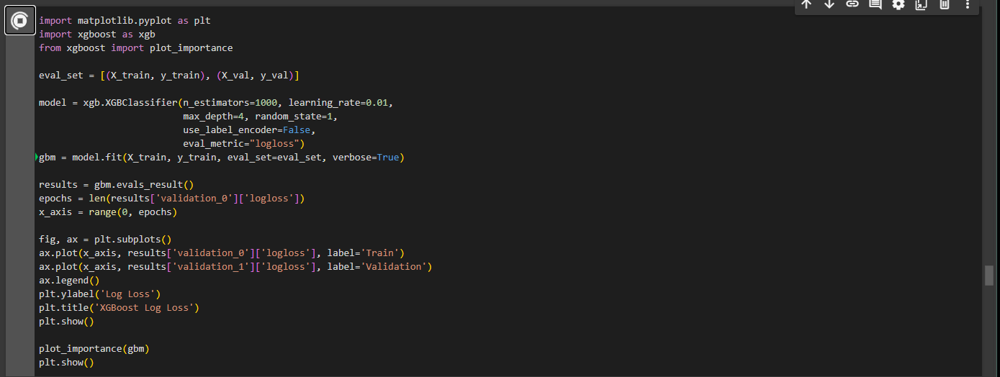

# Spaceship Titanic Problem with Kaggle
# ADD IN REFERENCES WHERE I HAVE TALKED ABOUT RECOMMENDED PARAMETERS

## Executive Summary

This project explores the Spaceship Titanic problem using machine learning (classifiers), to accurately predict a target variable (whether a passenger would be transported to another dimension) depending on a set of given features. The potential benefits are adding to the data science research community by showcasing new ways of tacking this classification task, which will also help companies discover new ways to solve business problems.
The Spaceship Titanic problem is a new ML classification problem with the goal of getting an highly accurate predictive model to help push the boundaries of data science.

## Data Preprocessing

The dataset used for this project was sourced from Kaggle's ["Spaceship Titanic Data"](https://www.kaggle.com/c/spaceship-titanic/data). 
This dataset was produced by Kaggle and it contains various features like passenger expenditures on different services all the way to boolean features like did the customer have VIP, CyroSleep and so on. There are around 9,000 records within the train set, and with 13 features, there was enough data here to faciliate testing whether a classifier could accurately predict the target variable.

### Loading and Initial Exploration

I began by importing all the relevant python packages and then importing the train dataset which was in a csv format. The dataset was loaded into a Pandas DataFrame using the `pd.read_csv()` function. 

The initial exploration of the dataset was then conducted to gain insights into its structure and contents.

### Data Selection and Renaming

From first thoughts, I planned to drop both 'PassengerId' and 'Name', to focus on the relevant columns for the problem. However doing further digging it seems that the passengers were split into groups and therefore share the same suffix e.g. '0001' depending on what group they were in. This would be a valuable categorical feature.

`df.drop(['Name'], axis=1, inplace=True)`

From here, I decided to split the PassengerId and Cabin features to capture their informations more clearly. 

`df[['Deck', 'Num', 'Side']] = df['Cabin'].str.split('/', expand=True)`

`df.drop(['Cabin'], axis=1, inplace=True)`

`df[['PassengerGroup', 'PassengerNumber']] = df['PassengerId'].str.split('_', expand=True)`

`df.drop(['PassengerId'], axis=1, inplace=True)`

### Handling Missing Values

Rows containing missing values in the any of the records needed to be dropped as a large majority of machine learning models do not allow for unknown values.

I first tackled the room number feature, 'Num', and as it only had 199 missing values I just decided to these records from the dataset. This was because capturing these missing values with encoding techniques would confuse the final ML model, due to the high co-linearity.

`df.dropna(subset=['Num'], inplace=True)`

To carry on with the handling of the categorical feautres, I then created boolean columns (with int64 datatypes) to capture missing values for each categorical feature which had missing values.

`df['CryoSleep_Missing'] = df['CryoSleep'].isnull().astype(int) # int64 by default`

`df['Destination_Missing'] = df['Destination'].isnull().astype(int)`

`df['VIP_Missing'] = df['VIP'].isnull().astype(int)`

`df['HomePlanet_Missing'] = df['HomePlanet'].isnull().astype(int)`

After this, I one-hot encoded the categorical features so that ML models could interpret the categorical information. Note that this transformation is an requirement for a lot of ML models.

`df = pd.get_dummies(df, columns=['HomePlanet', 'Side', 'CryoSleep', 'Destination', 'VIP'], dtype=int)`

Then for the last categorical feature I converted the category labels directly into integers to highlight the ordinal aspect of this feature. In other words, I wanted to clearly show the ML model that there was an order to the decks of the ship i.e. Deck A is 1, Deck B is 2, and so on.

`deck_mapping = {
    'A': 7, # reverse order to highlight Deck A is highest deck
    'B': 6,
    'C': 5,
    'D': 4,
    'E': 3,
    'F': 2,
    'G': 1,
    'T': 0
}`

`df['Deck'] = df['Deck'].map(deck_mapping)`

After these transformations I was left with a dataframe looking like the following (this is just an subset due to the size of the dataframe):

I now needed to handle the missing/invalid values within the numerical data. From some exploratory data anaylsis it was found that the 'Age' field had entries of 0. It doesn't make sense for someone to be 0 years old, therefore these values were set to missing with `df['Age'] = df['Age'].replace(0, np.nan)`.

These were the missing values counts for the numeric fields `df.isnull().sum()`:

Age	175
RoomService	177
FoodCourt	178
ShoppingMall	206
Spa	181
VRDeck	184

As there were lots of records in this dataset, I decided to impute the missing values for this features using a k-nearst neighbour (KNN) algorithm. This algorithm works by clustering data points around a set number of centroids (centre points), until the data points no longer change between clusters or a set maximum number of iterations is reached. I used the KNNImputer class from the sklearn package, and set it to have 5 clusters. To note, for medium sized datasets 4-6 is the advised number of clusters for this algorithm.

`imputer = KNNImputer(n_neighbors=5)`

`numeric_cols = ['Age', 'RoomService', 'FoodCourt', 'ShoppingMall', 'Spa', 'VRDeck']`

`df[numeric_cols] = imputer.fit_transform(df[numeric_cols])`

And as you can see all missing values were removed from the numeric fields:

### Standardizing the Features 

Standardizing features so that they have mean's of 0 and unit variances of 1, helps machine learning models converge (stabilize) during training alot quicker. In other words, it helps these models get to an optimal accuracy faster. This is due to the fact that a lot of weights and biases within Ml models are set to 0 in their initializations, and if features are standardized then the optimization algorithm (usually gradient descent) can reach the global minima quicker.

The equation for standardizing a feature is as follows:

This equation can be done with numpy (a package within python) and setting our dataframe to an numpy array, however sci-kit learn provides methods to standardize features a lot more effiecently. To note it does not make sense to standardize categorical feautres which have been encoded, therefore only the numeric features were standardized.

`scaler = StandardScaler() # part of sci-kit learn library`

`numeric_cols = ['Age', 'RoomService', 'FoodCourt', 'ShoppingMall', 'Spa', 'VRDeck']`

`df[numeric_cols] = scaler.fit_transform(df[numeric_cols])`

As you can see this standardized the numeric feautres:

### Evaulating Feature Importance

As I now had I large number of features, 26 to be exact, I wanted to find out which features had the most importance for this classification problem. This was largely due to the fact that a large number of the features were encoded features, and therefore I suspected alot of co-linearilty as apparent. Co-linearilty is anything bad, but it just introduces rendunant features, i.e. you could get the same information/worth out of one feature instead of two.

I split the features and target varaible:

`X_train = df.drop(['Transported'], axis=1)`

`y_train = df['Transported']`

And then used the Random Forest classification model, from the sklearn package, to understand which features had the most importance. This works because as the Random Forest is creating it's decision trees for the task, it also tracks the importance of each variable (feature). This happens because the model uses these values to understand which features increase the model accuracy most by having greater impurity reductions.

It can be seen that in the case of training this Random Forest Classifier, the features 'Num' (room_number), 'PassengerGroup' and 'Age', are the three features that have the highest importance. I was surprised by these results as I thought the 'Deck' feature would have more of an importance. This graph also highlights the number of features which have very little importance or value to the model. I will discuss these more in the next chapter.

### Reducing Model Dimensionality for Visualisation Purposes

Currently there are 26 features, a mix of categorical and numerical, within the dataset. To visualise the spread of the classes (0, 1) within 'Transported' (the target variable), I would like to reduce the dimensions to 2, whilst keeping the majority of information. This is so that I can then plot the Transported variable on a 2-dimensional scatter plot. This will then allow me to observe whether the classes are linearly seperable within Transported.

To reduce the number of dimensions, a common technique is using Principal Component Analysis. In short, PCA creates a covariance matrix, obtains the eigenvectors and eigenvalues from this matrix, construct a projection matrix (W) from the (sorted) top k eigenvectors, and lastly transform the orginal matrix (your features) using the project matrix (W) to get the new k-dimensional subspace.

The below is an graph which highlights one of the processes within PCA. It's shows that most of the variance within all of the k-features can be explained by just two featues.

And this is the whole idea behind PCA, trying to retain the most amount of information whilst decreasing the dimensional space to k. k here, is a number you decide.

Anyway, I used the PCA class from sklearn to efficiently reduce my 26 dimensional feature dataset, down to 2 dimensions (or 2 features).

With the features now down to two dimensions, I could visualise the Transported field:

From this plot we can now see that there is a definite pattern however the classes (yellow & purple), are mixed together with no clear linearl seperability at all. The next stage is now to decide which model to use and carry out training and testing.

## Training and testing a model

In this section, we walk through the steps of training a ML model to solve the classification problem, with the cleaned and standardized features. The classification problem is to accuractely predict which passengers will be transported to an alternate dimension, therefore the goal is to minimize the error function (the loss). 

### Deciding on what model to use

As our dataset contains a lot features that are both numeric and categorical I decided to start of my experiments by using decision trees with boosting. This would be an ensemble model, as multiple decision trees (weak learners) are brought together to create a model which is accurate (low bias) but also genaralizes well to unseen data (low variance). This is where boosting excels as each decision tree added to the model focuses on correcting the residuals (errors) from the previous decision tree. To prevent overfitting too, regularization would have be incorporated to prevent certain weights within the model becoming to 'strong', by adding in weight decay (L2 regularization). Or setting certain features' weights to 0 which effectively removes those irrevelant features, also known as (L1 regularization).

With all these requirements listed out it is clear that XGBoost would definetly be a good model to try first for this task. The XGBoost model has a gradient boosting algorithm which helps it learn the optimal weights effiecently. Here is a general outline of how the gradient boosting algorithm works for a binary classification problem of either 0 or 1.

### Training XGBoost to predict Transported

To use XGBoost optimially I split the dataset into train and validation sets, on a 95/5 split, then also used stratify to make sure the distribution between class 0 and 1 was the same across the train and validation sets. And then for reproducibility we set a random state of 0. Then lastly I import the XGBoost package, to utilize the XGBoost model. Again the parameters here are off best advise from the data science community. Plus these parameters can be optimized later. 

We can see that the model obtained an accuracy score of 83% on the training, and 80% on the validation set, meaning the model probably overfitted slightly. We can plot learning curves to visualise this, and to also see whether the model converged (stabilized) during training.

The preceding graph shows that the model finds the optimal weights for the model, as further training wouldn't decrease the loss by much. The graph also shows how near the 600 epoch the model starts to learn the training data too much. This is because the loss continues to decrease on the training data but doesn't as much for the validation data. This could be reduced with early stopping (stopping training at epoch 500), regularization (L1 or L2), or better feature selection.

### Using the XGBoost to predict Transported

So Kaggle provided two files, a train set in which we have trained the model on, and a test set which hasn't been seen yet. This test set is another csv but this time without the transported (target variable) within it. It is now the models job to predict for each of the test records (passengers) whether they were transported or not.

To make sure I obtain accurate results I first carry out all the transformations I did on the train set, on the test set. This included handling any missing values, standardizing features, encoding categorical features and so on.

After this, the last stage is to call predict on the trained model and passing in the data you want to make predictions for. See below for the predictions variable which holds an array of the predicitons.

### Results and Analysis

Due to the test set coming only with the features, I cannot see how well the model did at predicting the new unseen data. However, due to using a validation set during training I got a good idea how well this model could generalize. Due to the small difference between the train and validation accuracy scores and a small gap between there learning curves, it would be fair to say that we could expect a 80%-85% accuracy score for the test set we have just predicited.

## Recommendations for Future Iterations

1. **Incorporating Hyperparameter Tuning:** Future iterations of this project could expand from using academic suggestions for the parameters to actually using techniques like grid search or packages like Optuna which achieves the same thing. Hopefully, this would improve the accuracy of the model.

2. **Stopping overfitting:** In future iterations I would also like to reduce the amount of overfitting, with techniques like regualrization, to increase the models generalizability.

3. **Incorporate the model into MLFlow and productionise:** Consider productionising this model with tools like MLFlow and increase work effiency by using its UI for experiments when it comes to testing other models/hyperparameters.

## Challenges Encountered

One challenge encountered during the project was trying to use and plot the validation learning curves. This was solved when I realised model.fit could take eval_set as a parameter.
Also the handling of missing values was tricky due to the mix of categorical and numerical data. What helped was realising that removing one or two rows which are proving to be difficult, can actually help the model generalize better.

## References

1. [Amazon Product Dataset 2020](https://www.kaggle.com/datasets/promptcloud/amazon-product-dataset-2020)
2. [Google OR-Tools Documentation](https://developers.google.com/optimization/pack/knapsack)
3. Medium Articles:
   - [Exploring the Bin Packing Problem](https://medium.com/swlh/exploring-the-bin-packing-problem-f54a93ebdbe5)
   - [The Knapsack Problem: A Guide to Solving One of the Classic Problems in Computer Science](https://levelup.gitconnected.com/the-knapsack-problem-a-guide-to-solving-one-of-the-classic-problems-in-computer-science-7b63b0851c89)
